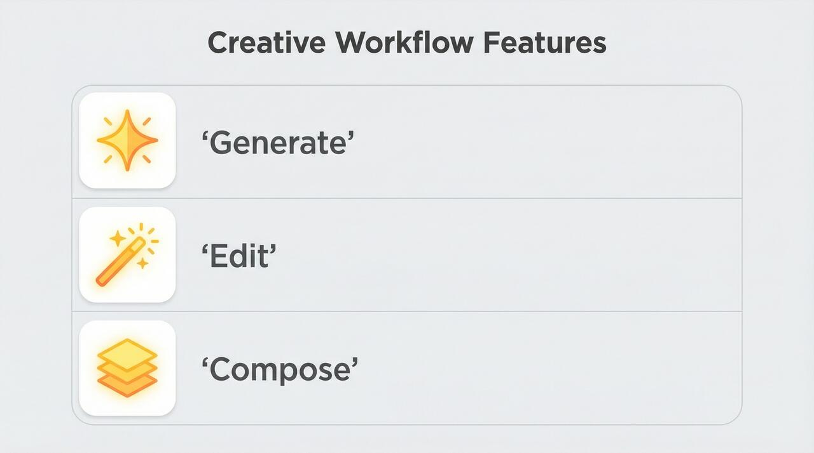
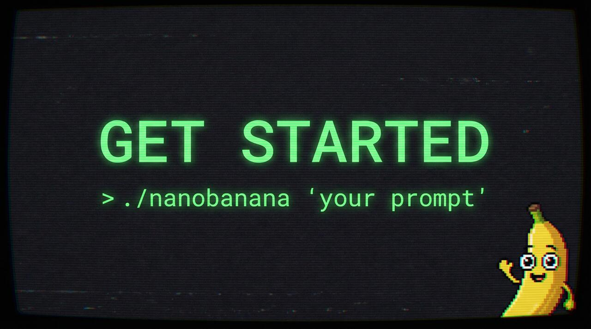

# Presentation Slide Generation

This example demonstrates using Claude Code to read a markdown presentation and generate slide images with nanobanana.

## Files

| File | Description |
|------|-------------|
| `presentation.md` | Source markdown with slide descriptions and prompts |
| `slide_01_title.jpg` | Generated title slide |
| `slide_02_features.jpg` | Generated features slide |
| `slide_03_cta.jpg` | Generated call-to-action slide |

## Generated Slides

*Note: Images have been resized and compressed for repository sharing. Original output was 2K resolution.*

### Slide 1: Title


### Slide 2: Features


### Slide 3: Call to Action


## Workflow

1. Write slide descriptions in `presentation.md`
2. Claude Code reads the markdown and extracts prompts
3. Each slide is generated with nanobanana:

```bash
./nanobanana -aspect 16:9 -size 2K -o slide_01_title.jpg "prompt..."
./nanobanana -aspect 16:9 -size 2K -o slide_02_features.jpg "prompt..."
./nanobanana -aspect 16:9 -size 2K -o slide_03_cta.jpg "prompt..."
```

## Parameters

- **Aspect ratio:** 16:9 (widescreen presentation format)
- **Size:** 2K (high resolution for presentations)
